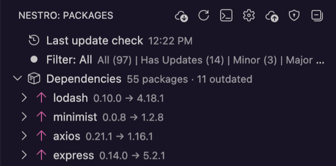

# Nestro — Package Manager for VS Code

Nestro is a powerful VS Code extension that lets you seamlessly manage your npm, pnpm, yarn, and bun packages right from the sidebar. It provides real-time update status, version switching, and security audits to keep your dependencies healthy.

## Features

### 📦 Multi-Package Manager Support
Works out of the box with `npm`, `pnpm`, `yarn`, and `bun`. Nestro automatically detects your project's package manager and runs the appropriate commands.

### 🔍 Smart Update Detection
Easily spot outdated packages in your sidebar. Filter by update type (patch, minor, breaking) to quickly identify which dependencies need attention.

### 🛡️ Security Audits
Run `npm audit` directly from the UI to discover vulnerabilities in your dependencies and visualize them natively in the VS Code sidebar.

### 🔧 Version Management
Upgrade to the latest versions with a single click, pick specific versions from a dropdown, switch between `dependencies` and `devDependencies`, or pin versions to prevent accidental upgrades.

### 🏗️ Monorepo Support
Automatically discovers multiple `package.json` files across your workspace, organizing them neatly into workspaces for seamless monorepo management.

## Getting Started

1. Open a workspace containing at least one `package.json`.
2. Click on the **Nestro** icon in the Activity Bar to open the sidebar view.
3. You will see a list of all your packages. Nestro will automatically check for updates or you can run it manually.
4. Click on the update icon next to an outdated package or right-click to see more options like "Pick Version...", "Switch to dev/dep", or "Toggle version pin".

## Settings

| Setting | Type | Default | Description |
|---|---|---|---|
| `nestro.checkUpdatesOnStartup` | boolean | `false` | Automatically check for package updates when the extension activates. |
| `nestro.includePreReleases` | boolean | `true` | Include pre-release versions when checking for package updates. |
| `nestro.updateTarget` | string | `"latest"` | Version target strategy for update checks (`latest`, `greatest`, `minor`, `patch`). |
| `nestro.defaultFilter` | string | `"all"` | Default package sidebar filter (`all`, `hasUpdates`, `patch`, `minor`, `breaking`). |
| `nestro.deferInstallAfterUpdate` | boolean | `false` | Update `package.json` first and run dependency installation separately. |
| `nestro.confirmBulkUpdate` | boolean | `true` | Show confirmation dialog before updating all visible packages. |
| `nestro.runAuditOnStartup` | boolean | `false` | Run npm audit automatically when the extension activates. |
| `nestro.monorepoGlob` | string | `"**/package.json"` | Glob used to discover `package.json` files in the workspace. |

## Requirements

- VS Code `^1.120.0` or higher.
- `npm`, `pnpm`, `yarn`, or `bun` installed on your system.

## Known Issues

Currently, Nestro supports basic auditing mainly via `npm audit` and relies on installed package managers. Make sure your package manager CLI is available in the system PATH.

## Release Notes / Changelog

See the [CHANGELOG.md](CHANGELOG.md) for details about the latest updates and release history.
