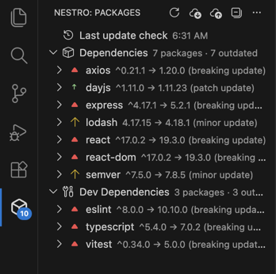
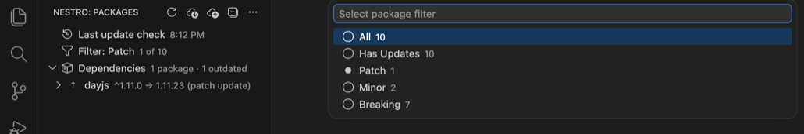
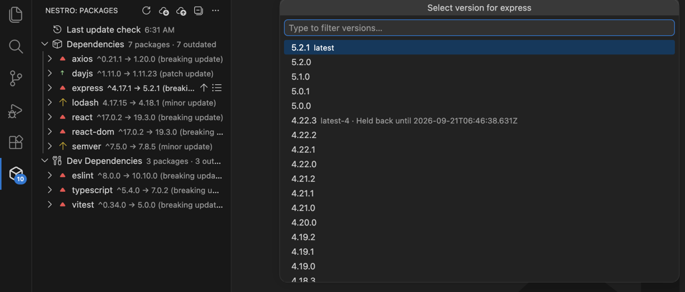
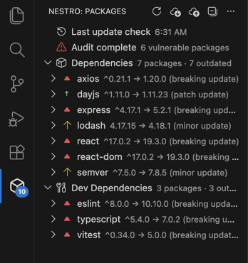

# Nestro — Package Manager for VS Code

[](https://marketplace.visualstudio.com/items?itemName=greentech-solutions.nestro)
[](https://open-vsx.org/extension/greentech-solutions/nestro)
[](https://marketplace.visualstudio.com/items?itemName=greentech-solutions.nestro)

[](https://github.com/GreenTech-Solutions/nestro/actions/workflows/ci.yml)

Nestro manages npm, pnpm, Yarn, and Bun dependencies from a sidebar in VS Code: it lists every
`package.json` in your workspace, checks for updates on demand (or once at startup if you enable
that), and lets you update, pin, switch, or remove a dependency without leaving the editor.

## Requirements

- VS Code `1.125.0` or later (`engines.vscode: ^1.125.0`).
- One of `npm`, `pnpm`, `yarn`, or `bun` available on your system `PATH`.

## Installation

**Visual Studio Marketplace** — open the Extensions view and search for "Nestro", paste
`ext install greentech-solutions.nestro` into Quick Open (`Ctrl/Cmd+P`), or open the [Marketplace listing](https://marketplace.visualstudio.com/items?itemName=greentech-solutions.nestro) directly.

**Open VSX** — for VS Code-compatible editors that use Open VSX, install from the
[Open VSX listing](https://open-vsx.org/extension/greentech-solutions/nestro).

**VSIX from GitHub Releases** — download a release from the
[Releases page](https://github.com/GreenTech-Solutions/nestro/releases). Each release includes
the `.vsix` package together with its `.sha256` checksum, a file manifest, an SBOM, and a
provenance attestation, so the artifact can be verified before installing. Install the downloaded
file with:

```
code --install-extension nestro-<version>.vsix
```

## Getting started

1. Open a workspace folder that contains at least one `package.json`.
2. Click the **Nestro** icon in the Activity Bar to open the sidebar view.
3. The view lists every discovered package, grouped into Dependencies and Dev Dependencies.
   Nestro does not check for updates automatically unless you enable
   `nestro.checkUpdatesOnStartup`; run **Check for Updates** from the toolbar to check manually.
4. Update an outdated row with its inline update icon, or right-click a row for more actions.

## The sidebar

### Toolbar

Three primary actions sit directly on the view title bar: **Refresh**, **Check for Updates**, and
**Update All** (the last one only appears when the current filter has at least one package with
an available update). The overflow menu (`…`) groups the rest:

- **Search Packages**, **Select Filter**, and **Clear Search Query** (the last only appears while
  a search is active);
- **Run Install**, **Run Security Audit**, and **Pin All Versions**;
- **Settings**.

Entries that have nothing to act on are hidden: the search, filter, and pin entries need at least
one dependency, Run Install needs a readable manifest, and Run Security Audit needs a project with
a lockfile.

### Package rows

Each row shows an inline **Update Package** action when it has an available update, and an
inline **Pick Version...** action to open a version list. Right-clicking a row opens a context
menu with **Open on npmjs.com**, **Copy Package Name**, **Switch to dev/dep**, **Toggle version
pin** (shown only when the dependency's current version spec supports pinning), and
**Remove Package**.

### Filter, search, and status

The active filter and any search text are not shown as rows in the tree — they render as the
compact text next to the view title (for example `Has Updates (3)` or `Has Updates (3) ·
"react"`). Select Filter opens a picker for All, Has Updates, Patch, Minor, or Breaking, each
with a live count. The sidebar badge shows the number of packages with an available update under
the All filter, independent of whatever filter is currently active.

Status rows appear above the package groups when relevant: a run in progress ("Checking
updates…", "Running audit…"), a summary ("Last update check", "Audit complete"), or a problem
("Package read incomplete", "Update check incomplete", "Audit incomplete", "Audit failed",
"Workspace package loading failed"). Rows that report a failure are clickable and open the
diagnostics report.

## Update checks

Nestro never checks for updates in the background on its own schedule. A check runs only when you
click **Check for Updates**, or once — after the initial package scan — on each activation if you
enable `nestro.checkUpdatesOnStartup` (disabled by default).

- **Cache and debounce** — a repeated check within `nestro.checkUpdatesDebounce` seconds (default
  `60`) is ignored and the cached result stays on screen, as long as the package files and update
  settings are unchanged; a config or package-set change bypasses the debounce
  automatically. Set `nestro.checkUpdatesForceAlways` to always fetch immediately instead.
- **Version target** — `nestro.updateTarget` (default `"latest"`) controls how far an update may
  move: `latest`, `greatest`, `minor`, or `patch`.
- **Release-age cooldown** — `nestro.minimumReleaseAgeDays` (default `7`) holds back a release
  until it has been published for that many days; set it to `0` to disable this policy. A release
  still inside its cooldown is classified as held back rather than offered, a release whose
  publish time is unavailable is reported as unknown, and applying a held-back version asks for
  confirmation first.
- **Prereleases** — alpha, beta, and release-candidate versions are excluded unless you enable
  `nestro.includePreReleases` (default `false`).

## Updating packages

Update a single package from its inline action, or use **Pick Version...** to choose any listed
version instead of the accepted one. **Update All** updates every package currently visible under
the active filter; when `nestro.confirmBulkUpdate` is enabled (default `true`), it asks for
confirmation first.

Enable `nestro.deferInstallAfterUpdate` to write the chosen versions to `package.json` without
running the package manager; run **Run Install** afterward to install the updated dependencies
and refresh the lockfile. With it disabled (the default), each update runs the package manager
immediately.

## Managing dependencies

- **Switch to dev/dep** moves a dependency between `dependencies` and `devDependencies`. If the
  target section already declares that package name, nothing is written and Nestro reports the
  conflict instead of guessing which entry should win.
- **Toggle version pin** drops the range prefix from a single dependency's current spec
  (`^1.2.3` → `1.2.3`) or restores a caret range; it is available only when the dependency's spec
  supports pinning.
- **Pin All Versions** pins every dependency whose version spec Nestro can rewrite safely — an
  exact, caret, or tilde range over a concrete version — in one atomic operation: every file's new
  content is prepared before any write happens, and if a later write fails, every file already
  written is rolled back. A manifest that fails to parse is skipped and named in the result
  instead of aborting the whole run.
- **Remove Package** deletes a dependency after a confirmation dialog.

## Security audit

**Run Security Audit** runs the detected package manager's own audit command for every resolved
project in the workspace (see the support matrix below), and reports vulnerabilities as row badges
when an advisory can be uniquely attributed to that row's resolved version — an ambiguous or
transitive-only finding stays in the project-level report only. **Open Security Audit Report**
opens the full report, including project-level results, in the **Nestro Security Audit** Output
channel. Enable `nestro.runAuditOnStartup` (default `false`) to run one audit per project after
the initial scan on each activation.

## Monorepos and multi-root workspaces

Nestro discovers every `package.json` matching `nestro.monorepoGlob` (default
`**/package.json`); `node_modules` is always excluded, whatever the glob. Discovery refreshes automatically when that setting or the workspace folder list
changes. Rows are grouped by owning workspace folder and then by package root, labeled
`<workspace name> — <relative path>` (or `— (root)` for the top-level manifest). When more than
one `package.json` exists, **Run Install** asks which package root to install for; it never
installs every root at once.

## Package manager support matrix

| Manager | Detection | Install / Update / Remove | Security audit | Version metadata | Notes |
|---|---|---|---|---|---|
| npm | `packageManager` field, else nearest `package-lock.json` / `npm-shrinkwrap.json` walking up to the workspace folder | `npm install` / `npm install <pkg>@<version> [--save-dev]` / `npm uninstall` | `npm audit --json` | `npm view <pkg> --json` | Default when no other signal is found. |
| pnpm | `packageManager` field, else nearest `pnpm-lock.yaml` | `pnpm install` / `pnpm add <pkg>@<version> [--save-dev]` / `pnpm remove` | `pnpm audit --json` | `pnpm view <pkg> --json` | Highest lockfile precedence among the four. |
| Yarn Classic (1.x) | `yarn.lock` or `packageManager: yarn`; the Classic family is then resolved by `packageManager: yarn@1.x`, `.yarnrc`, a `# yarn lockfile v1` header, or a bounded `yarn --version` probe | `yarn install` / `yarn add <pkg>@<version> [--dev]` / `yarn remove` | `yarn audit --json` | `yarn info <pkg> --json` | Separate command and result schema from Yarn Modern. |
| Yarn Modern (Berry) | `yarn.lock` or `packageManager: yarn`; the Modern family is then resolved by `packageManager: yarn@2+`, `.yarnrc.yml`, a `__metadata:`-versioned `yarn.lock`, or the version probe | Same `yarn` commands as Classic | `yarn npm audit --all --recursive --json` | `yarn npm info <pkg> --json` | Audits the full project graph in one call. Conflicting markers or an unresolved Yarn family disable the audit action rather than guessing. |
| Bun | `packageManager` field, else nearest `bun.lock` / `bun.lockb` | `bun install` / `bun add <pkg>@<version> [--dev]` / `bun remove` | `bun audit --json` | No native metadata command; version lookups always use the HTTPS metadata path | |

For npm, pnpm, and Yarn the native command is the first tier: when it fails or is unavailable,
metadata falls back to the same bounded HTTPS path Bun uses.

Package-manager detection walks up ancestor directories from a package's own directory to its
owning workspace folder; the nearest directory with a recognized signal wins, and the
`packageManager` field wins over lockfiles in the same directory.

## Screenshots

### Package overview


### Filter by update type


### Pick a specific version


### Security audit


## Settings

| Setting | Type | Default | Description |
|---|---|---|---|
| `nestro.checkUpdatesOnStartup` | boolean | `false` | Run one update check after the initial package scan when the extension activates. |
| `nestro.includePreReleases` | boolean | `false` | Include alpha, beta, and release-candidate versions in update checks and the Pick Version list. |
| `nestro.minimumReleaseAgeDays` | number | `7` | Minimum age in days before Nestro accepts a release for an update check; `0` disables this policy. |
| `nestro.updateTarget` | string | `"latest"` | Version target for update checks: `latest`, `greatest`, `minor`, or `patch`. |
| `nestro.defaultFilter` | string | `"all"` | Sidebar filter shown when Nestro starts: `all`, `hasUpdates`, `patch`, `minor`, or `breaking`. |
| `nestro.deferInstallAfterUpdate` | boolean | `false` | Write updated versions to `package.json` without running the package manager; run **Run Install** separately. |
| `nestro.confirmBulkUpdate` | boolean | `true` | Show a confirmation dialog before **Update All** runs. |
| `nestro.runAuditOnStartup` | boolean | `false` | Run one security audit per resolved project after the initial package scan on each activation. |
| `nestro.monorepoGlob` | string | `"**/package.json"` | Glob used to discover `package.json` files in the workspace. |
| `nestro.checkUpdatesDebounce` | number | `60` | Minimum seconds between update checks when package files and policy are unchanged; `0` disables the debounce. |
| `nestro.checkUpdatesForceAlways` | boolean | `false` | When no check is already running, run every **Check for Updates** click immediately, bypassing the debounce and the cache. |

## Private registries and network

The version picker and release-age classification honor `.npmrc` (npm/pnpm), `.yarnrc` (Yarn
Classic), `.yarnrc.yml` (Yarn Modern), and `bunfig.toml` (Bun). The update check itself runs
`npm-check-updates`, which reads only npm configuration and `.yarnrc.yml` — it does not read
`.yarnrc` or `bunfig.toml`, so in Yarn Classic and Bun projects the update check follows the npm
configuration instead, falling back to the public npm registry when nothing there sets one. An
unsupported or unstable response from a configured private registry never falls through to the
public registry; the affected operation reports the failure instead. See
[SECURITY.md](SECURITY.md) for the full network model.

## Workspace trust, virtual, and remote workspaces

Nestro declares `untrustedWorkspaces` and `virtualWorkspaces` as unsupported: it does not activate
in Restricted Mode or a virtual workspace. It runs fully in Remote SSH, Dev Containers, and WSL
through the workspace extension host, so its file access and package-manager processes run on the
remote or container side, not on the local client. See [SECURITY.md](SECURITY.md) for details.

## Troubleshooting

- **Output channels** — Nestro writes to three local VS Code Output channels: `Nestro` (general
  log), `Nestro Security Audit`, and `Nestro Diagnostics`. Nothing is sent anywhere else.
- **Open Diagnostics Report** (from the Command Palette) opens the `Nestro Diagnostics` channel, with a full breakdown of any
  package read, update check, or audit failure.
- **Open Security Audit Report** (from the Command Palette) opens the `Nestro Security Audit` channel with the full audit
  report, including projects that only appear there because their result could not be attributed
  to a single row.
- **"Package read incomplete"** means at least one `package.json` failed to read or parse; open
  the diagnostics report for the list of affected files.
- **"Update check incomplete"** / **"Audit incomplete"** mean at least one project's check or
  audit failed while others succeeded; the successful results are still shown, and the diagnostics
  or audit report names the roots that failed.
- **Stale results** — **Refresh** reloads every `package.json` from disk. If Check for Updates
  seems to do nothing, you may be inside the `nestro.checkUpdatesDebounce` window; wait it out,
  change a relevant setting, or enable `nestro.checkUpdatesForceAlways`.
- **Deferred install reminder** — with `nestro.deferInstallAfterUpdate` enabled, an update only
  writes `package.json`; run **Run Install** to actually install the new versions.

## Security & Privacy

Nestro sends no telemetry and reports nothing to any external service. It runs only the four
package-manager CLIs a project can already declare, and contacts a package registry over HTTPS to
check for updates, resolve versions, and — through those CLIs — run security audits; it writes
only `package.json` files, never a lockfile directly. See [SECURITY.md](SECURITY.md) for
the full security model, the list of processes and network calls Nestro makes, known limitations,
and how to report a vulnerability privately.

## Contributing

See [CONTRIBUTING.md](CONTRIBUTING.md) for the local development setup, test commands, and
commit-message conventions.

Bug reports and feature requests go to
[GitHub Issues](https://github.com/GreenTech-Solutions/nestro/issues); security reports go through
the private route in [SECURITY.md](SECURITY.md) instead.

## Release notes

See [CHANGELOG.md](CHANGELOG.md) for release history.

## License

[MIT](LICENSE)
